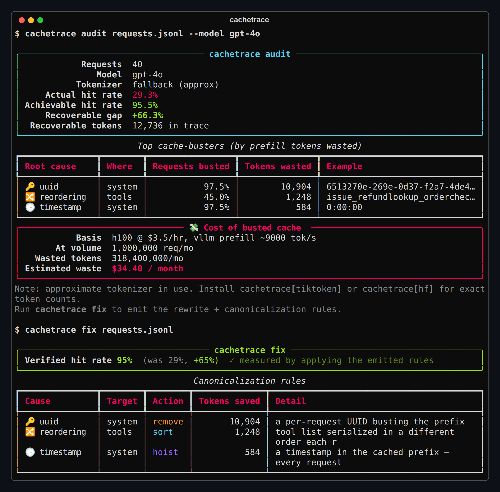
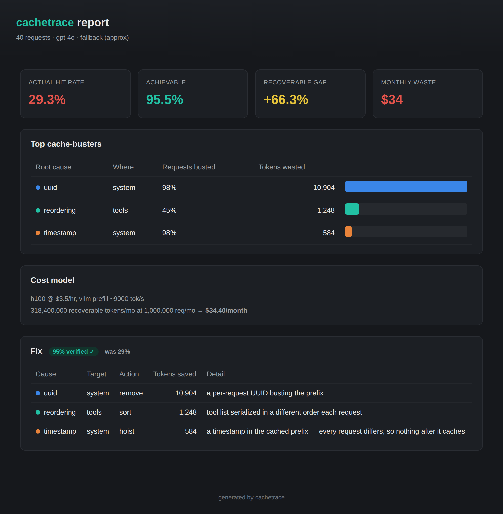

# cachetrace

**Prefix-Cache Efficiency Auditor.** Find and fix what silently busts your LLM prefix cache.

[](https://github.com/jahnavi-yelamanchi/cachetrace/actions/workflows/ci.yml)
[](https://www.python.org/)
[](LICENSE)

Teams pay **5-10x more** for inference than they should because prompt construction
quietly breaks prefix caching: a timestamp in the system prompt, a per-request UUID,
a reordered metadata block, a non-deterministically serialized tool list. vLLM/SGLang
report a *cache hit rate*, but never **why** it's low or **what it's costing you**.

`cachetrace` is the engineer who reads your prompt templates by hand, as software. It
builds a radix tree over your actual token streams, computes the **achievable-vs-actual**
hit-rate gap, attributes each divergence to a specific template position and root cause,
estimates the monthly dollar waste, then **emits the fix**.

```bash
pip install cachetrace          # core
pip install "cachetrace[all]"   # + real tokenizers, proxy, dashboard
```

## 60-second demo

```bash
cachetrace demo          # runs on a bundled agent trace
```

<p align="center"></p>

The `fix` number is **verified**: it's measured by actually applying the emitted rules
and re-simulating, so cachetrace never overclaims. `cachetrace fix requests.jsonl --out
./fix` writes both a declarative `cachetrace_fix.yaml` and a drop-in
`cachetrace_canonical.py`.

## Dashboard

`cachetrace serve --trace requests.jsonl` (or `cachetrace audit --html report.html`) gives
you a self-contained, shareable view of the same analysis:

<p align="center"></p>

## Why this is different

Everyone else shows you a hit-rate number. cachetrace tells you the **root cause**, the
**template location**, the **dollar cost**, and hands you the **rewrite**:

## Why this is different

Everyone else shows you a hit-rate number. cachetrace tells you the **root cause**, the
**template location**, the **dollar cost**, and hands you the **rewrite**:

| | hit rate | why it's low | $ cost | the fix |
|---|:---:|:---:|:---:|:---:|
| vLLM / SGLang metrics | ✅ | ❌ | ❌ | ❌ |
| **cachetrace** | ✅ | ✅ | ✅ | ✅ |

### The depth

- **Tokenizer-aware, token granularity.** Prefix caching happens on the *rendered token
  stream* after chat templating, not the raw string. cachetrace auto-detects your model
  and uses the real tokenizer (HuggingFace `apply_chat_template` or tiktoken), falling
  back to a dependency-free approximate tokenizer when neither is installed.
- **Radix-tree simulation matching real engines.** A block-based radix tree (vLLM-style
  block hashing, SGLang RadixAttention semantics) with LRU eviction replays your trace to
  produce the *actual* achieved hit rate, then a canonicalized replay for the ceiling.
- **Constant/varying decomposition.** A timestamp *and* a UUID in the same system prompt
  are separated, classified, and priced independently, not lumped into one blob.
- **Cost model per GPU + engine + provider.** Self-hosted ($/GPU-hour ÷ prefill
  throughput) or hosted (input vs cache-read price), projected to your monthly volume.

## Benchmark: real-world receipts

`cachetrace bench` reconstructs the **default** prompt construction of popular agent
frameworks and audits it. Their out-of-the-box templates leave a lot on the table
(approximate tokenizer, H100 + vLLM, 1M req/mo; full report in
[`BENCHMARK.md`](BENCHMARK.md)):

| Framework | Actual hit rate | Achievable | Gap | Top cache-buster |
|---|---:|---:|---:|---|
| LangChain ReAct agent | 14% | 94% | **+80%** | timestamp in `system` |
| CrewAI crew | 22% | 92% | **+70%** | uuid in `system` |
| OpenAI Agents tool loop | 83% | 91% | **+8%** | reordering in `tools` |
| RAG chat | 0% | 85% | **+85%** | random_id in `system` |

## Usage

```bash
# Audit a JSONL trace of requests (OpenAI, Anthropic, or canonical format)
cachetrace audit requests.jsonl --model gpt-4o --gpu h100 --engine vllm --volume 2000000

# Hosted pricing instead of GPU cost model
cachetrace audit requests.jsonl --provider anthropic

# Emit the fix (rules + Python transform + template rewrite)
cachetrace fix requests.jsonl --out ./fix --emit both

# Explain one request's divergence
cachetrace explain requests.jsonl req-17

# Self-contained interactive HTML report
cachetrace audit requests.jsonl --html report.html

# Machine-readable output for CI + a regression gate
cachetrace audit requests.jsonl --json
cachetrace diff before.jsonl after.jsonl --threshold 0.05   # non-zero exit on regression

# Interactive web dashboard (needs cachetrace[web])
cachetrace serve --trace requests.jsonl

# Drop-in recording + fixing proxy (needs cachetrace[proxy])
cachetrace proxy --upstream https://api.openai.com --record traffic.jsonl --fix-rules ./fix/cachetrace_fix.yaml

# Benchmark popular agent frameworks' default prompts
cachetrace bench --out BENCHMARK.md
```

### Input format

One JSON object per line. cachetrace auto-detects the provider format:

```jsonl
{"model": "gpt-4o", "messages": [{"role": "system", "content": "..."}, {"role": "user", "content": "..."}], "tools": [...]}
```

OpenAI-compatible (OpenAI, Azure, Together, Fireworks, Groq, vLLM/SGLang/TGI OpenAI
servers, DeepSeek, Mistral, and more) and Anthropic Messages formats are supported today,
with Gemini/Bedrock and agent-framework trace adapters on the roadmap.

### Use it as a library

```python
from cachetrace.core.analyze import audit
from cachetrace.core.ingest import load_batch
from cachetrace.config import Config

reqs = load_batch("requests.jsonl").requests
report = audit(reqs, Config(model="gpt-4o", gpu="h100"))
print(report.actual.token_hit_rate, "vs", report.achievable.token_hit_rate)
for b in report.busters:
    print(b.cause, b.path, b.wasted_tokens)
```

## Configuration

Flags override a `cachetrace.toml` in the working directory (see
[`cachetrace.toml.example`](cachetrace.toml.example)):

```toml
[cachetrace]
model = "gpt-4o"
engine = "vllm"       # vllm | sglang | tgi
gpu = "h100"          # h100 | a100 | l40s | ...
block_size = 16       # KV block size in tokens
monthly_volume = 2_000_000
```

## Roadmap

- [x] Core engine: tokenize, radix simulate, attribute, cost
- [x] `audit` + `fix` (verified, no-overclaim) + `explain` + `diff` + `init`
- [x] Provider-agnostic ingest: OpenAI-compatible, Anthropic, Gemini, Bedrock, agent-framework traces, vLLM logs
- [x] Self-contained HTML report (`--html`) + local **web dashboard** (`cachetrace serve`)
- [x] Live drop-in recording + canonicalizing **proxy** (`cachetrace proxy`)
- [x] `cachetrace bench`: wasted-cache findings across popular agent frameworks
- [ ] Real-tokenizer CI parity fixtures + upstream PRs from the benchmark
- [ ] Optional React dashboard build

## Development

```bash
pip install -e ".[dev]"
pytest
ruff check src tests
```

## License

Apache-2.0
